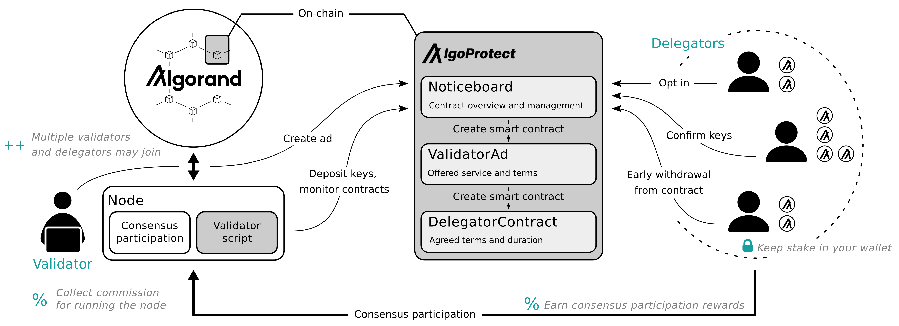

# IgoProtect

Welcome to the IgoProtect - a decentralized peer-to-peer consensus delegation platform!

The platform can be accessed on Testnet at: [https://igoprotect.vercel.app/](https://igoprotect.vercel.app/)

This README provides an overview of the platform, instructions for its use, and deployment in a local environment.

The project was developed using [AlgoKit](https://developer.algorand.org/algokit/).
The smart contracts have been written in [Algorand Python](https://github.com/algorandfoundation/puya).
The frontend has been written in React.js Typescript with Tailwind CSS.

## Overview

The goal of this project is to improve the decentralization and security of the Algorand blockchain by increasing the number of nodes and the percentage of the online stake that participates in its consensus.
To achieve this goal, the developed platform serves as a decentralized system for connecting users to node runners to enable their simple participation in the network's consensus.
This is achieved via delegation of users' ALGO stakes to the node runners' nodes.

### The Approach and its Benefits
The IgoProtect platform takes advantage of the native delegation ability of the Algorand protocol that separates user's private keys, which are used to sign transactions, and [participation keys](https://developer.algorand.org/docs/get-details/algorand_consensus/#participation-keys), which are used for participation in the network's consensus.
This approach greatly minimizes potential risks to the users because their ALGO holdings never leave their wallets, which is the case with other solutions like pooling or liquid staking.
Because the consensus participation is linked directly to the user's wallet, it automatically updates when the user adds or removes funds, offering a seamless UX, superior to other solutions that require additional actions from the user to add or reduce one's online stake.
Moreover, with the [upcoming change](https://www.algorand.foundation/2024-roadmap) to incentivization of accounts that participate in consensus on Algorand, the rewards will directly be deposited in the user's wallets.
This improved UX has the potential to drive more users to participation in the consensus.
Furthermore, the approach enables the use of ALGO that is locked in a user's account, i.e. the minimum balance requirement.
A further benefit is a simple and direct participation in Algorand governance programs like xGov.
Last but not least, because accounts participate directly on the nodes, which can successfully host at most a handful of accounts, there is greater potential for high decentralization of the network compared to pooling solutions.

### Design and Implementation
#### Noticeboard, Ads, and Contracts
The IgoProtect platform can be thought of as a noticeboard, where anyone that runs a node can advertise its node running services.
Users, that would like to participate in the consensus, can check the noticeboard and freely initiate a contract for the advertised service of the chosen node runner.
At contract conclusion, the user define the contract start and end times.

Other contract terms are defined based on the node runner's ad.
These include obligations of the user like:
- The amount of ALGO required to be held in the user's wallet.
This is to make efficient use of the node runners hardware capabilities, e.g. it is inefficient to have a high-availability node host an account with little ALGO as it will be selected infrequently to participate in the consensus.
The node runner can give some leeway to the user for breaching these terms.
- The required fees paid to the node runner for the service.
The fees are split into:
    - Setup fee:
This is required because initiating a contract by the delegator happens in two steps.
First, the node runner setups up its node for the user.
This is a computationally intensive task.
The user then needs to confirm the setup.
Until the setup is confirmed, the node runner is wasting resources.
To prevent spamming attacks, it is recommended to charge a setup fee.
    - Operational fee:
This is the fee charged by the node runner for the service per amount of time of the operation.
This is to cover the node running costs.
- The maximum time the node runner will wait for the user to confirm the setup once it has been generated.

For a smooth UX, the ad also defines obligations of the node runner like:
- The uptime guarantee for the service.
*Note: The feature is not yet used. It will be implemented once the new Algorand protocol changes are live.*
- The maximum time the user needs to wait for the node runner to setup the node once the contract has been initiated.
In case the node runner does not setup the node in time, the user is refunded the setup fee in full.

The ad defines some non-mandatory information about the node runner like its name and a link to more information about them.
Based on these, the users can judge whether to trust the node runner to participate in consensus on their behalf or not.
The node runner can omit this information for anonymity reasons.

The parameters of the ad can be configured by the node runner.
Once a contract is concluded, the parameters of the contract cannot be changed anymore.
However, the ad can be modified for concluding future contracts.
Moreover, the node runner can halt accepting of new users and configure their maximum allowed number.
If there are no active users at a node runner, the ad can be deleted.

A user can withdraw from an active contract at any point of time.
In this case, the user will be refunded the unspent portion of the operational fee and the full deposit.
Early withdrawal from the contract is allowed for the safety of the Algorand network.
It servers for example the case when a user loses its trust in a node runner during an active contract because of change in behaviour.
The user is not penalized for this.

*Note: Blockchain does not include exact notion of time. That is why at IgoProtect, the time is measured in block numbers, also referred to as rounds. This detail has not yet been abstracted away from the user at the UI. Similarly, the blockchain operates with assets in their base units, e.g. with micro ALGO. This detail also has not yet been abstracted away from the user at the UI. The micro ALGO is marked on the platform as* `uALGO`.

#### Automatic Request Servicing Script
As part of the IgoProtect platform, an automatic request servicing script is provided for the participating node runners.
The purpose of the script is to automatically detect initiation of new contracts by the users and setup the node in response.
Moreover, the script periodically checks if the contract terms are respected and reacts accordingly.
For these interactions with the blockchain, the script requires its own wallet that contains a manager address.
The manager address is part of the node runner ad configuration.
The wallet that is part of the request servicing script is a hot wallet and should contain only minimal funds to cover transaction fees.
The script can be replaced with own request servicing script.

#### Accountability
Since the users' funds never leave their wallets for participation in consensus via IgoProtect, the platform requires a deposit to be able to dissuade breaching of the contract terms, e.g. the required ALGO amount.
Similarly, the node runners need to be held accountable to provide the agreed quality of the service to their users.
The deposits will be seized in case of detected malicious behaviour.
The process is fully auditable, automatic, and transparent.
Validator can require larger deposits than required by the platform.
The platform currently sets a minimum deposit of 0.1 ALGO.

#### Business Model
For sustaining the operation of the platform, it deducts a fixed percentage of the fees charged by the node runners.
Depending on the platform's success, a portion of the collected fees can be refunded to the users in form of loyalty programs (*in development*).
The platform's designated operator will also participate in the consensus with the users' deposits.

## User Guide

Landing page - connect with the wallet for best experience.

*Note: If at any point you get lost or it seems things are not progressing as expected, click the "Home" icon in the header.*

### User Type Determination
There are two types of users of the IgoProtect platform.
The term **delegator** is used for users that hold ALGO in their wallets and want to participate in the consensus but do not wish to run their own nodes.
The term **validator** is used for node runners, i.e. users that operate the nodes and participate in the consensus by validating and proposing new blocks.
Each type of user has unique interactions with the platform.
These are described in the following (i.e. for delegators and for validators).

The users first need to connect with their wallet to the platform.
They are welcomed by a question to select whether they are a delegator or a validator.

### Delegators

As a delegator, you only need to select one validator from the list of validators that is offering their node running services through the decentralized platform IgoProtect.
The selection can be made based on validator's requirements like limits to ALGO stake, fees, and other operating information. Validator ad can also include a link to more information about the validator, where you can learn about the validator and judge its competence.

You conclude a service contract for the node running directly with the validator, and define the contract start and end times.
After creation of the contract, you need to wait for a limited amount of time for the validator to set up its system for you. After the setup has been performed, you only need to confirm it. And easy as that, you have started to protect Algorand together with the help of IgoProtect!

A video guide for delegators is available [on our Youtube channel](https://youtu.be/zMjw1SdDQn4).

### Validators

As a validator, you will need to service the incoming request from the delegators for your node running services.
IgoProtect provides a Python script that does this automatically for you.
You can find instructions for its setup [in our guide](/projects/i-go-protect/validator-script/README.md).

For the script to be able to service the requests automatically, the script needs an Algorand wallet.
This is a hot wallet and should only hold minimal funds for covering transaction fees.
With the manager wallet ready, head to IgoProtect website and simply create your validator ad.
In the ad, define your requirements for your delegators, like the required stake limits, your fees and other mandatory operating information. You can also provide optional information about yourself to convince potential delegators to use your services.
You also need to provide the public address of your manager account and specify how many delegators can you accommodate with your node.

After creating the advertisement and confirming its setup, you only need to copy the ID of your created validator ad into the config file of the servicing script, and run the script.
Now you are ready to automatically manage delegators and help to protect Algorand!

A video guide for validators that want to advertise their services via IgoProtect is available [on our Youtube channel](https://youtu.be/LOmgJMUB6x4).
There is also a [video guide](https://youtu.be/_hYqhcWp164) on how to manage an existing validator that is using IgoProtect.

## More Information

For more information about the project, check the project [pitch](/pitch/pitch.pptx) and [demo video](https://youtu.be/Bystrpc-Pkg).
Follow the project also at various social networks like X ([@IgoProtect](https://x.com/IgoProtect)) and Youtube ([@IgoProtect](https://www.youtube.com/@IgoProtect)).

# Use on Testnet

The platform can be accessed at: [https://igoprotect.vercel.app/](https://igoprotect.vercel.app/)
It is connected to Algorand Testnet.
The Noticeboard app ID is: [680343624](https://testnet.explorer.perawallet.app/application/680343624/)
For testing, you will need an Algorand compatible wallet like [Defly](https://defly.app/) or [Pera](https://perawallet.app/) with an account with some testnet ALGO.
You can get testnet ALGO with [Testnet dispenser](https://bank.testnet.algorand.network/).

If you test the platform, please give us any feedback you might have via any social networks. Thank you already in advance for helping to improve IgoProtect!

# Use in Local Environment

## Prerequisites
The project was developed using AlgoKit. Before starting, ensure you have AlgoKit and all of its dependencies installed.
You can find installation guide [here](https://developer.algorand.org/docs/get-started/algokit/).
AlgoKit version 2.0.6 or higher is required. You can check your version by running `algokit --version`.

## Getting Started
This section provides instructions for deploying the platform on AlgoKit localnet and locally running the UI.

1) Clone this repository: `git clone https://github.com/uhudo/igoprotect/`
2) Navigate to the `ROOT` project directory: `cd i-go-protect`
3) Install all dependencies: `algokit project bootstrap all`
4) Start localnet: `algokit localnet start`
5) Deploy a new instance of the platform: `algokit project deploy localnet`
6) Navigate to `frontend` directory `cd projects/frontent` and start the UI by running `npm run dev`. You can access the UI at ` http://localhost:5173/`.
*Note: the command will execute* `algokit project link --all`*, which will regenerate Typescript clients used by the UI. Due to an error in generation procedure, you will get two errors:* `ERROR: Multiple exports with the same name "Struct2UInt64"`
*and* `ERROR: The symbol "Struct2UInt64" has already been declared` *Please manually delete from* `projects/frontend/src/contracts/DelegatorContract.ts` *the double generated type and function* `Struct2UInt64` *to remove the errors reported by the UI.*

For easier testing of the platform with multiple users that have different roles, it is recommended to create multiple accounts in `KMD`.
This can be done for example by opening: https://app.dappflow.org/kmd-portal, and going to `unencrypted-default-wallet`, where new account can be created.
The new account can be funded e.g. by going to https://app.dappflow.org/node-manager/dispenser.

## Extra
The [smart contracts](/projects/i-go-protect/smart_contracts) have already been build and the compiled TEAL code is available in directory [artifacts](projects/i-go-protect/smart_contracts/artifacts).
If desired, the smart contracts can be rebuild by running `algokit project run build` in `projects/i-go-protect`.
Note, however, that some smart contracts are creating other smart contracts.
AlgoKit does currently not support automatic compilation and importing of the compiled code for such purposes.
That is why it is necessary to manually compile the contracts after they are build, inserting the compiled code to the parent smart contract, and rebuilding and recompiling the parent smart contract.

Automatic tests of the individual smart contracts and the platform as a whole are available in `projects/i-go-protect/tests`.
These can be executed by navigating to `projects/i-go-protect` and running the command `algokit project run test`.

# Notice
This product was developed as part of the Algorand Foundation's [Change the Game hackathon](https://www.algorand.foundation/algorand-hackathon), submitted to the consumer track.

The project authors are:
- [Teodora Mitrevska](https://de.linkedin.com/in/teodora-mitrevska-b444a810a) (@[TeodoraLmu](https://github.com/TeodoraLmu)): [product management](/pitch)
- [Uroš Hudomalj](https://ch.linkedin.com/in/uro%C5%A1-hudomalj-3922a1252) (@[uhudo](https://github.com/uhudo)): [smart contracts](/projects/i-go-protect/smart_contracts) and [UI](/projects/frontend/)
- [Alexander Marinšek](https://be.linkedin.com/in/alexander-marinsek) (@[AlexanderMarinsek](https://github.com/AlexanderMarinsek)): [backend](/projects/i-go-protect/validator-script)

